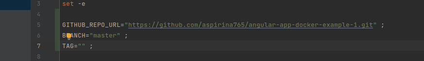
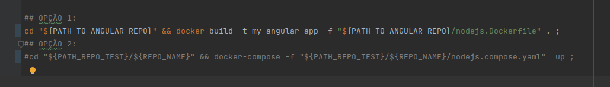

## Test Suite para Angular com NodeJS 16.19.0

Este repositório clona um repositório de _**Angular**_ e _**NodeJS versão 16.19.0**_ por meio do bash script _**run-git-repo.sh**_ e o testa em _**docker**_ e/ou _**docker-compose**_.

### Configuração Rápida

Basta configurar a _**url**_, a _**branch**_ e a _**tag**_ (**não obrigatória**, basta deixar "" vazia) do repositório de github que se quer clonar (na pasta ```respo-test/```)

``` console
GITHUB_REPO_URL="" 
BRANCH="" 
TAG=""
```


no arquivo ```run-git-repo.sh``` , e executá-lo pelo comando: 

``` bash
bash run-git-repo.sh
```

E então o teste será executado. 

Existem duas opções para teste, em ```docker``` e em ```docker-compose``` (no mesmo arquivo ```run-git-repo.sh```), conforme imagem abaixo:



Para usar uma e/ou outra, basta _**comentar**_ ou _**descomentar**_ os comandos correspondentes.

